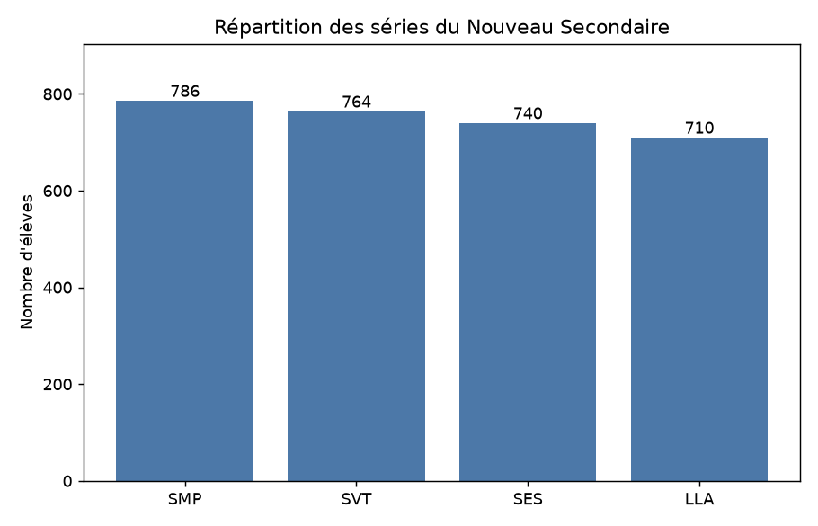
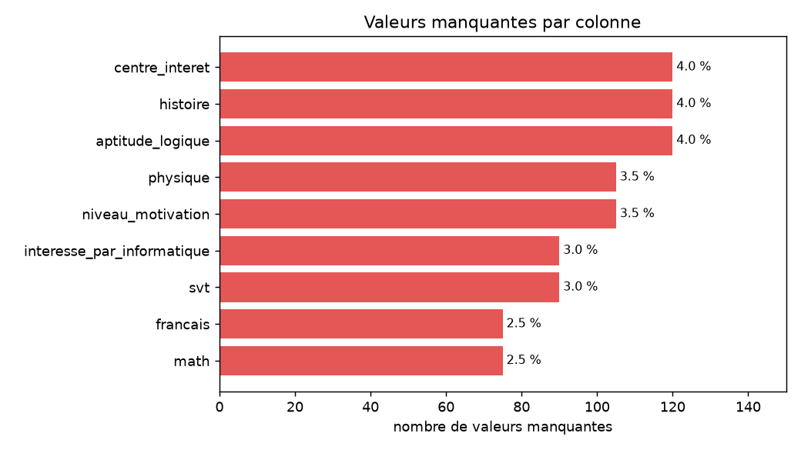
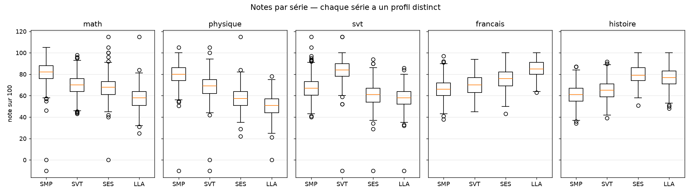
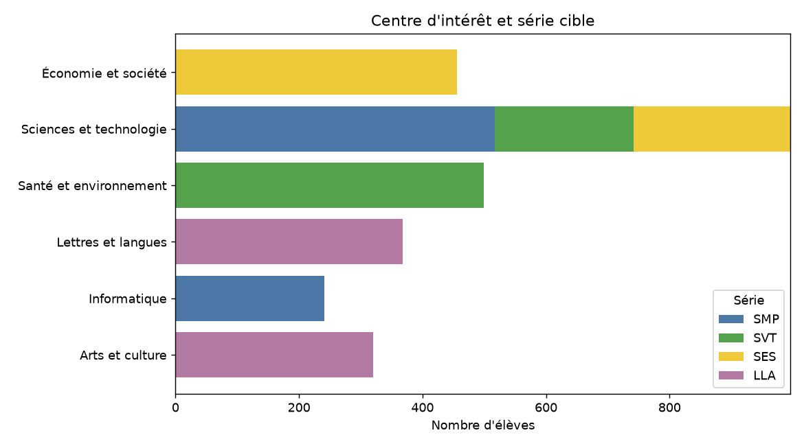
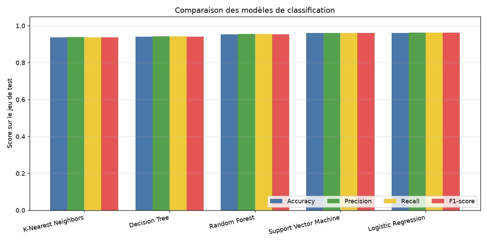
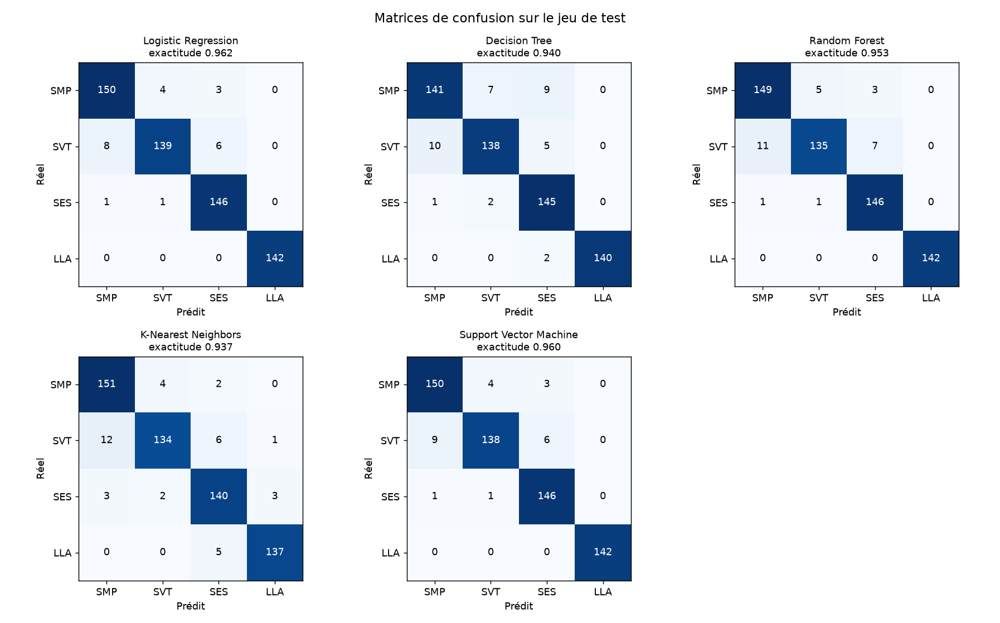
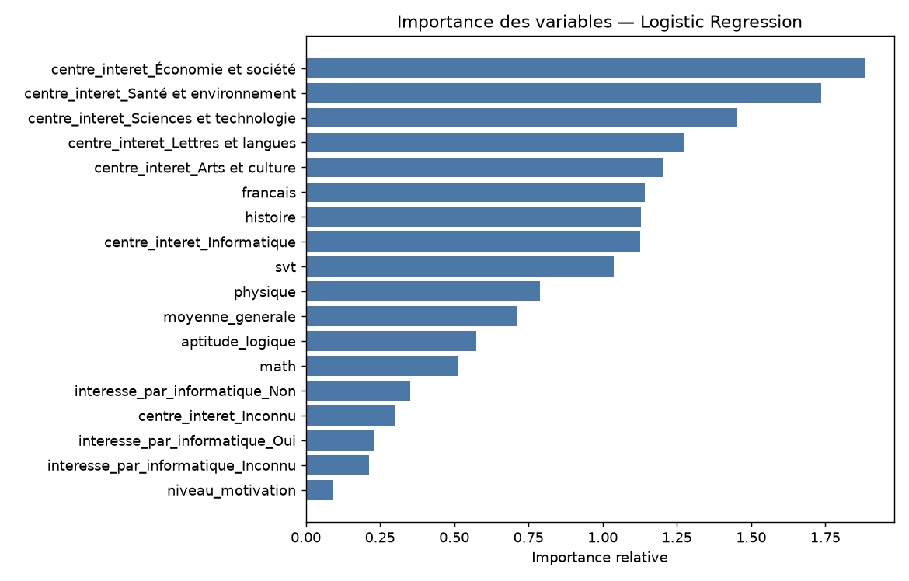
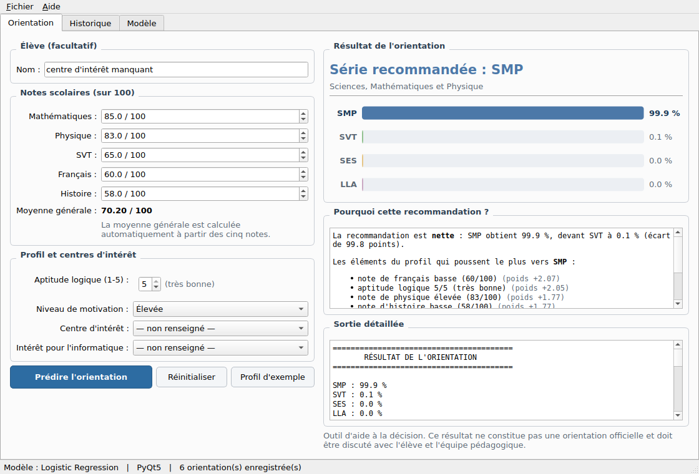
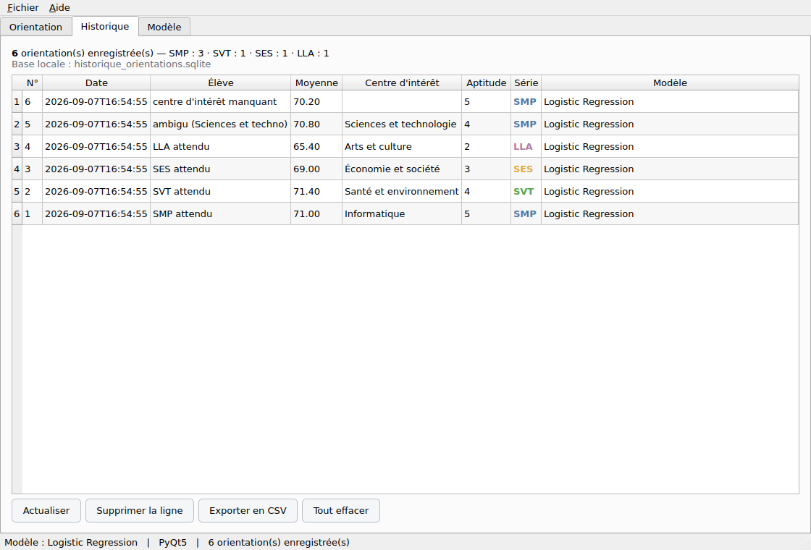
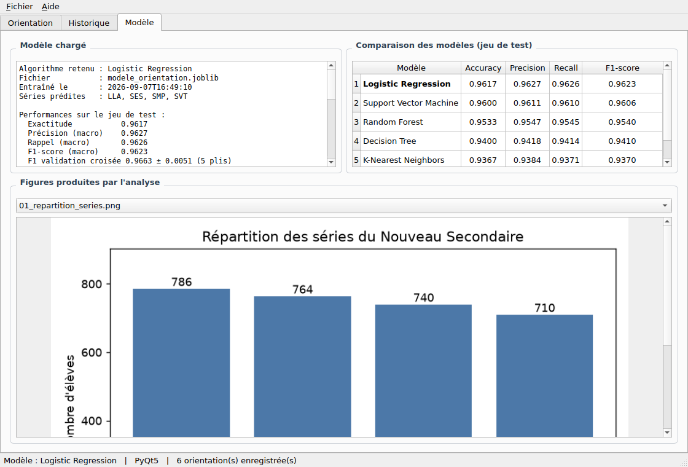

# Rapport de projet — Système d'aide à l'orientation scolaire

**Projet IA2 — UNITECH, niveaux 3 et 4 Sciences Informatiques**
Séries du Nouveau Secondaire : SMP, SVT, SES, LLA

---

## Sommaire

1. [Contexte et problématique](#1-contexte-et-problématique)
2. [Description du jeu de données](#2-description-du-jeu-de-données)
3. [Analyse exploratoire](#3-analyse-exploratoire)
4. [Traitements effectués](#4-traitements-effectués)
5. [Techniques d'encodage](#5-techniques-dencodage)
6. [Modèles testés](#6-modèles-testés)
7. [Métriques obtenues et comparaison](#7-métriques-obtenues-et-comparaison)
8. [Modèle retenu et justification](#8-modèle-retenu-et-justification)
9. [Application PyQt](#9-application-pyqt)
10. [Limites du système](#10-limites-du-système)
11. [Réponse à la question centrale](#11-réponse-à-la-question-centrale)
12. [Conclusion](#12-conclusion)

---

## 1. Contexte et problématique

Dans le cadre du Nouveau Secondaire en Haïti, les élèves sont orientés vers
quatre séries : SMP (Sciences, Mathématiques et Physique), SVT (Sciences de
la Vie et de la Terre), SES (Sciences Économiques et Sociales) et LLA
(Lettres, Langues et Arts).

Cette orientation engage plusieurs années de scolarité et conditionne l'accès
aux filières universitaires. Elle repose aujourd'hui sur l'appréciation des
enseignants et des conseillers, avec deux difficultés pratiques : le volume
d'élèves à traiter en fin d'année, et l'hétérogénéité des critères d'un
établissement à l'autre.

**Problématique.** Peut-on construire, à partir des performances scolaires et
de quelques éléments de profil, un modèle capable de proposer automatiquement
la série la plus compatible avec un élève, et à quelles conditions une telle
proposition serait-elle utilisable ?

Le système développé est explicitement un **outil d'aide à la décision** : il
propose, il ne décide pas.

---

## 2. Description du jeu de données

Fichier fourni : `dataset_orientation_NS_3000_final.xlsx`, converti en CSV
dans `data/dataset_orientation_NS_3000.csv`.

**3 000 élèves × 12 colonnes**, aucun doublon, 3 000 identifiants uniques.

| Colonne | Type | Description | Valeurs |
| --- | --- | --- | --- |
| `id_eleve` | texte | identifiant technique | `NS10001` … |
| `math` | numérique | note de mathématiques | 0–100 |
| `physique` | numérique | note de physique | 0–100 |
| `svt` | numérique | note de SVT | 0–100 |
| `francais` | numérique | note de français | 0–100 |
| `histoire` | numérique | note d'histoire | 0–100 |
| `moyenne_generale` | numérique | moyenne des cinq notes | 52,8–83,4 |
| `aptitude_logique` | ordinale | aptitude au raisonnement | 1 à 5 |
| `niveau_motivation` | ordinale | motivation déclarée | Faible, Moyenne, Élevée, Très élevée |
| `centre_interet` | catégorielle | domaine d'intérêt principal | 6 modalités |
| `interesse_par_informatique` | binaire | intérêt pour l'informatique | Oui / Non |
| `serie_cible` | **cible** | série du Nouveau Secondaire | SMP, SVT, SES, LLA |

Le jeu de données est **simulé à des fins pédagogiques** et contient
volontairement des valeurs manquantes et des valeurs anormales.

---

## 3. Analyse exploratoire

Script : `python exploration.py` → `reports/exploration.txt` et figures
`reports/01…05_*.png`.

### 3.1 Répartition de la cible

| Série | Effectif | Part |
| --- | ---: | ---: |
| SMP | 786 | 26,2 % |
| SVT | 764 | 25,5 % |
| SES | 740 | 24,7 % |
| LLA | 710 | 23,7 % |



Les classes sont **équilibrées** (rapport max/min = 1,11). Aucune technique de
rééquilibrage n'est nécessaire, et l'exactitude reste une métrique
interprétable. La **référence à battre** est celle d'un modèle qui prédirait
toujours SMP : **26,2 %**.

### 3.2 Valeurs manquantes

Neuf colonnes sur douze en contiennent, entre 2,5 % et 4 %.

| Colonne | Manquants | % |
| --- | ---: | ---: |
| `histoire` | 120 | 4,0 % |
| `aptitude_logique` | 120 | 4,0 % |
| `centre_interet` | 120 | 4,0 % |
| `physique` | 105 | 3,5 % |
| `niveau_motivation` | 105 | 3,5 % |
| `svt` | 90 | 3,0 % |
| `interesse_par_informatique` | 90 | 3,0 % |
| `math` | 75 | 2,5 % |
| `francais` | 75 | 2,5 % |



Total : **900 cellules manquantes sur 30 000 valeurs**, soit 3 %. Mais elles
sont **dispersées** : seules **2 222 lignes sur 3 000** (74,1 %) sont
complètes. Supprimer les lignes incomplètes coûterait donc **25,9 % de
l'échantillon** pour n'écarter que 3 % de valeurs — d'où le choix de
l'imputation.

`moyenne_generale` est la seule variable **sans aucun trou**.

### 3.3 Valeurs aberrantes

Deux lectures différentes ont été menées.

**a) Valeurs physiquement impossibles.** Une note ne peut pas valoir −10 ni
115. Le jeu de données en contient 17, réparties sur 3 colonnes :

| Colonne | Minimum | Maximum | Sous 0 | Au-dessus de 100 |
| --- | ---: | ---: | ---: | ---: |
| `math` | −10 | 115 | 1 | 4 |
| `physique` | −10 | 115 | 2 | 3 |
| `svt` | −10 | 115 | 3 | 4 |
| `francais` | 38 | 100 | 0 | 0 |
| `histoire` | 34 | 100 | 0 | 0 |

`aptitude_logique` ne prend que les valeurs entières 1 à 5 : aucune anomalie.

**b) Valeurs extrêmes au sens de l'écart interquartile.** Rares et toujours
plausibles (par exemple un 100 en mathématiques). Elles ont été **conservées** :
un excellent élève n'est pas une erreur de saisie.

### 3.4 Une découverte structurante : la cohérence de la moyenne

En recalculant la moyenne des cinq notes et en la comparant à la colonne
`moyenne_generale`, on observe :

- **2 544 lignes sur 2 562** (99,3 % des lignes sans note manquante) où les
  deux valeurs sont **exactement identiques** ;
- les 18 lignes qui divergent sont **précisément celles dont une note a été
  corrompue**.

Conclusion : `moyenne_generale` est la moyenne arithmétique non pondérée des
cinq notes, calculée **avant** l'injection des anomalies et des trous. Cela a
trois conséquences directes :

1. la règle de calcul de la moyenne est connue, et l'application PyQt la
   reproduit exactement ;
2. la colonne constitue un **témoin** permettant de repérer les notes fausses
   sans connaître leur valeur d'origine ;
3. elle contient une petite quantité d'information que les notes bruitées
   n'ont plus — ce qui explique qu'elle figure parmi les variables utiles du
   modèle.

### 3.5 Profils par série



Moyennes par série :

| Série | math | physique | svt | français | histoire | aptitude | moyenne |
| --- | ---: | ---: | ---: | ---: | ---: | ---: | ---: |
| SMP | **81,8** | **80,0** | 67,0 | 66,0 | 61,0 | **4,23** | 71,2 |
| SVT | 70,4 | 68,0 | **83,7** | 69,9 | 65,1 | 3,40 | 71,5 |
| SES | 67,3 | 57,4 | 60,7 | 75,8 | **79,6** | 3,19 | 68,2 |
| LLA | 57,6 | 51,0 | 57,9 | **85,5** | 77,0 | 2,54 | 65,8 |

Chaque série possède un profil net et cohérent avec son intitulé. L'aptitude
logique décroît régulièrement de SMP (4,23) à LLA (2,54).

Les corrélations confirment cette structure : `math` et `physique` sont liées
positivement (0,49) et toutes deux **négativement** au français (−0,40 et
−0,46). Le jeu de données oppose donc explicitement un axe scientifique et un
axe littéraire.

### 3.6 Le centre d'intérêt, prédicteur quasi déterministe



| Centre d'intérêt | LLA | SES | SMP | SVT | Série dominante |
| --- | ---: | ---: | ---: | ---: | ---: |
| Arts et culture | 320 | 0 | 0 | 0 | LLA — **100 %** |
| Lettres et langues | 368 | 0 | 0 | 0 | LLA — **100 %** |
| Économie et société | 0 | 456 | 0 | 0 | SES — **100 %** |
| Informatique | 0 | 0 | 241 | 0 | SMP — **100 %** |
| Santé et environnement | 0 | 0 | 0 | 499 | SVT — **100 %** |
| Sciences et technologie | 0 | 254 | 517 | 225 | SMP — 52 % |

**Cinq modalités sur six déterminent la série à elles seules.** Seule
« Sciences et technologie » (996 élèves, un tiers de l'échantillon) reste
réellement ambiguë.

C'est l'observation la plus importante de l'analyse : elle annonce une
exactitude élevée, mais **cette exactitude mesurera surtout la façon dont le
jeu de données simulé a été construit**. Nous y revenons au § 10.

### 3.7 Variables peu informatives

- `niveau_motivation` est très déséquilibré : 1 345 « Très élevée »,
  1 243 « Élevée », 293 « Moyenne » et **14 seulement en « Faible »**. Sa
  distribution est comparable d'une série à l'autre.
- `interesse_par_informatique` est presque équilibré (1 448 / 1 462) et
  n'apporte un signal que pour SMP (567 « Oui » contre 195 « Non »).

---

## 4. Traitements effectués

Tous les traitements sont encapsulés dans un `Pipeline` scikit-learn
(`preprocessing.py`). Ce choix est **structurant** : il garantit l'exigence du
cahier des charges — « appliquer exactement le même prétraitement que celui
utilisé lors de l'entraînement ». L'application PyQt ne réimplémente aucune
transformation, elle appelle `predict` sur le pipeline sérialisé.

```
NettoyeurValeurs → ColumnTransformer (imputations + encodages + normalisation) → Classifieur
```

### 4.1 Exclusion de l'identifiant

`id_eleve` est écarté des variables explicatives. C'est une clé technique
sans pouvoir prédictif : l'inclure reviendrait à laisser le modèle apprendre
par cœur des numéros d'élèves, avec un surapprentissage garanti et aucune
capacité de généralisation.

### 4.2 Valeurs aberrantes

Les notes hors de `[0, 100]` et les aptitudes hors de `[1, 5]` sont
**converties en valeurs manquantes**, puis traitées par les imputeurs.

Trois options étaient possibles ; le choix est justifié ainsi :

| Option | Effet | Décision |
| --- | --- | --- |
| Supprimer les lignes | perte de 17 élèves dont les autres colonnes sont correctes | écartée |
| Ramener aux bornes (0 ou 100) | transforme une erreur en note extrême crédible, donc en signal faux | écartée |
| Convertir en manquant puis imputer | l'anomalie est traitée comme une absence d'information | **retenue** |

Ce nettoyage est placé **dans le pipeline** : il s'applique donc aussi à la
prédiction, ce qui protège l'application contre toute valeur hors domaine.

### 4.3 Valeurs manquantes

| Type de variable | Stratégie | Raison |
| --- | --- | --- |
| Numériques (notes, moyenne) | médiane | insensible aux valeurs extrêmes, contrairement à la moyenne |
| `aptitude_logique` | médiane | échelle ordinale : la médiane reste une valeur de l'échelle |
| `niveau_motivation` | modalité la plus fréquente | variable ordinale à quatre niveaux |
| `centre_interet` | modalité **« Inconnu »** | voir ci-dessous |
| `interesse_par_informatique` | modalité **« Inconnu »** | idem |

Le choix d'une modalité « Inconnu » pour les deux variables textuelles
nominales est délibéré. Imputer `centre_interet` par son mode
(« Sciences et technologie ») reviendrait à **inventer une réponse** que
l'élève n'a pas donnée — et, s'agissant de la variable la plus influente du
modèle, à injecter un signal fort et faux dans 4 % des cas. Traiter l'absence
comme une information à part entière est à la fois plus honnête et plus utile :
l'application peut ainsi prédire pour un élève dont on ignore le centre
d'intérêt, tout en le signalant à l'utilisateur.

### 4.4 Normalisation

Les variables numériques et ordinales sont standardisées (`StandardScaler` :
moyenne 0, écart-type 1). C'est indispensable pour trois des cinq modèles :

- **KNN** raisonne sur des distances : sans normalisation, une note sur 100
  écraserait complètement une aptitude sur 5 ;
- **SVM** avec noyau RBF est également sensible aux échelles ;
- **Régression logistique** converge plus vite et ses coefficients deviennent
  comparables entre eux.

Les arbres et forêts n'en ont pas besoin, mais la normalisation ne leur nuit
pas : un seul pipeline sert donc pour tous les modèles.

### 4.5 Séparation entraînement / test

- 80 % entraînement (**2 400 élèves**) / 20 % test (**600 élèves**) ;
- découpage **stratifié** sur `serie_cible`, ce qui conserve la proportion des
  quatre séries de part et d'autre ;
- graine aléatoire fixée à **42** : les résultats sont reproductibles à
  l'identique.

Le jeu de test n'est utilisé qu'à la toute fin, pour l'évaluation. Le choix
des hyperparamètres s'appuie sur une **validation croisée à 5 plis** effectuée
uniquement sur les données d'entraînement.

---

## 5. Techniques d'encodage

Le cahier des charges demande de distinguer les types de variables. Chacun
reçoit un encodage adapté à sa nature.

| Type | Colonnes | Encodage | Justification |
| --- | --- | --- | --- |
| **Numérique continue** | `math`, `physique`, `svt`, `francais`, `histoire`, `moyenne_generale` | aucun encodage, standardisation | déjà quantitatives |
| **Ordinale numérique** | `aptitude_logique` (1–5) | conservée telle quelle, standardisée | l'échelle porte déjà l'ordre |
| **Ordinale textuelle** | `niveau_motivation` | `OrdinalEncoder` avec ordre **imposé** | voir ci-dessous |
| **Binaire** | `interesse_par_informatique` | `OneHotEncoder` → 3 colonnes | Non / Oui / Inconnu |
| **Catégorielle nominale** | `centre_interet` | `OneHotEncoder` → 7 colonnes | 6 modalités + Inconnu |
| **Identifiant** | `id_eleve` | **exclu** | aucun pouvoir prédictif |

### Pourquoi un encodage ordinal pour la motivation

L'ordre `Faible < Moyenne < Élevée < Très élevée` est explicitement déclaré
dans `config.ORDRE_MOTIVATION` et transmis à l'encodeur. Un one-hot détruirait
cette information : le modèle ne saurait pas que « Très élevée » est plus
proche de « Élevée » que de « Faible ». L'encodage ordinal la préserve en une
seule colonne.

À l'inverse, `centre_interet` est **nominale** : « Arts et culture » n'est ni
supérieur ni inférieur à « Informatique ». Un encodage ordinal y créerait un
ordre arbitraire que le modèle interpréterait comme une réalité — d'où le
one-hot.

### Robustesse de l'encodage

Les listes de modalités sont **déclarées explicitement** dans `config.py` et
transmises aux encodeurs (`categories=[...]`), avec `handle_unknown="ignore"`.
Le nombre de colonnes produites est donc figé, quelles que soient les
modalités présentes dans les données d'entrée. L'application PyQt ne peut pas
provoquer d'erreur de dimension, même en soumettant un profil inhabituel.

Au total, les 10 variables explicatives deviennent **18 colonnes numériques**.

---

## 6. Modèles testés

Le sujet demande au minimum trois algorithmes ; **cinq** ont été entraînés,
choisis pour couvrir des familles d'hypothèses réellement différentes plutôt
que des variantes d'une même idée.

| Modèle | Famille | Pourquoi il est adapté à ce problème |
| --- | --- | --- |
| **Logistic Regression** | linéaire | Référence naturelle en classification multi-classes. Rapide, entièrement interprétable — chaque coefficient dit dans quel sens une variable pousse vers une série — et fournit nativement des probabilités, ce que l'interface doit afficher. |
| **Decision Tree** | arbre | Capture les règles en escalier et les interactions sans mise à l'échelle. Se lit comme une suite de questions, ce qui correspond au raisonnement d'un conseiller d'orientation. Surapprend facilement seul, d'où `max_depth=8` et `min_samples_leaf=10`. |
| **Random Forest** | ensemble | Moyenne d'arbres décorrélés : garde la souplesse de l'arbre sans son surapprentissage. Robuste aux valeurs extrêmes résiduelles et fournit une mesure d'importance des variables. |
| **K-Nearest Neighbors** | par similarité | Un élève reçoit la série majoritaire parmi les profils qui lui ressemblent — exactement l'intuition d'une orientation « par comparaison avec les promotions précédentes ». Exige la normalisation, que le pipeline garantit. |
| **Support Vector Machine** | marge maximale | Cherche la frontière de séparation la plus large entre séries. Le noyau RBF gère les frontières non linéaires et se comporte bien sur quelques milliers de lignes. |

Chaque modèle est entraîné dans le **même pipeline**, sur le **même
découpage**, avec la **même graine** : la comparaison ne porte que sur
l'algorithme.

---

## 7. Métriques obtenues et comparaison

### 7.1 Métriques employées

- **Accuracy** — proportion de prédictions correctes. Interprétable ici car
  les classes sont équilibrées.
- **Precision (macro)** — parmi les élèves orientés vers une série, combien
  y appartenaient réellement.
- **Recall (macro)** — parmi les élèves d'une série, combien ont été
  correctement identifiés.
- **F1-score (macro)** — moyenne harmonique des deux précédentes.
- **Matrice de confusion** — détail des confusions entre séries.

Les moyennes **macro** traitent les quatre séries à poids égal. C'est la
lecture pertinente pour un outil d'orientation : négliger LLA parce qu'elle
compte un peu moins d'élèves serait inacceptable.

### 7.2 Tableau comparatif

Résultats sur les 600 élèves du jeu de test, jamais vus à l'entraînement.

| Modèle | Accuracy | Precision | Recall | F1-score | F1 val. croisée (5 plis) | Temps (s) |
| --- | ---: | ---: | ---: | ---: | ---: | ---: |
| **Logistic Regression** | **0,9617** | **0,9627** | **0,9626** | **0,9623** | 0,9663 ± 0,0051 | 0,05 |
| Support Vector Machine | 0,9600 | 0,9611 | 0,9610 | 0,9606 | 0,9614 ± 0,0060 | 0,21 |
| Random Forest | 0,9533 | 0,9547 | 0,9545 | 0,9540 | 0,9606 ± 0,0060 | 0,83 |
| Decision Tree | 0,9400 | 0,9418 | 0,9414 | 0,9410 | 0,9314 ± 0,0050 | 0,03 |
| K-Nearest Neighbors | 0,9367 | 0,9384 | 0,9371 | 0,9370 | 0,9463 ± 0,0078 | 0,03 |



### 7.3 Lecture des résultats

- **Les cinq modèles dépassent très largement la référence de 26,2 %.** Le
  signal est réel, et il n'est pas propre à une famille d'algorithmes.
- **L'écart entre le meilleur et le pire est faible** (2,5 points
  d'exactitude). Quand des modèles aussi différents qu'une régression
  linéaire et une forêt aléatoire aboutissent au même score, c'est que la
  structure des données est simple : la frontière entre séries est presque
  linéaire une fois les variables encodées.
- **La validation croisée confirme le classement du jeu de test** pour les
  trois premiers modèles, avec des écarts-types faibles (≤ 0,008) : les
  résultats sont stables et ne dépendent pas d'un découpage chanceux.
- L'arbre seul est le plus faible des modèles à base d'arbres, et la forêt le
  corrige de 1,3 point : l'effet d'ensemble joue son rôle attendu.

### 7.4 Matrices de confusion



Pour la régression logistique :

|  | prédit SMP | prédit SVT | prédit SES | prédit LLA |
| --- | ---: | ---: | ---: | ---: |
| **réel SMP** | **150** | 4 | 3 | 0 |
| **réel SVT** | 8 | **139** | 6 | 0 |
| **réel SES** | 1 | 1 | **146** | 0 |
| **réel LLA** | 0 | 0 | 0 | **142** |

Détail par série :

| Série | Precision | Recall | F1-score | Effectif |
| --- | ---: | ---: | ---: | ---: |
| SMP | 0,943 | 0,955 | 0,949 | 157 |
| SVT | 0,965 | 0,908 | 0,936 | 153 |
| SES | 0,942 | 0,986 | 0,964 | 148 |
| LLA | **1,000** | **1,000** | **1,000** | 142 |

Trois enseignements :

1. **LLA est prédite parfaitement** (142/142). Ses deux centres d'intérêt
   — « Arts et culture » et « Lettres et langues » — sont exclusifs, et son
   profil de notes est le plus tranché.
2. **Toutes les erreurs se concentrent entre SMP, SVT et SES**, c'est-à-dire
   exactement parmi les élèves déclarant « Sciences et technologie ». Le
   modèle ne se trompe que là où la donnée est réellement ambiguë.
3. **SVT a le rappel le plus faible** (0,908) : 14 élèves de SVT sur 153 sont
   orientés ailleurs. C'est la série la plus « au milieu » — bonne en
   sciences sans dominer les mathématiques.

### 7.5 Importance des variables



Coefficients moyens (valeur absolue) de la régression logistique :

| Rang | Variable | Poids |
| ---: | --- | ---: |
| 1 | `centre_interet` = Économie et société | 1,886 |
| 2 | `centre_interet` = Santé et environnement | 1,737 |
| 3 | `centre_interet` = Sciences et technologie | 1,450 |
| 4 | `centre_interet` = Lettres et langues | 1,272 |
| 5 | `centre_interet` = Arts et culture | 1,205 |
| 6 | `francais` | 1,141 |
| 7 | `histoire` | 1,130 |
| 8 | `centre_interet` = Informatique | 1,127 |
| 9 | `svt` | 1,037 |
| 10 | `physique` | 0,789 |
| 11 | `moyenne_generale` | 0,709 |
| 12 | `aptitude_logique` | 0,575 |
| 13 | `math` | 0,513 |

Les six premières places sont occupées par les modalités du centre d'intérêt,
ce qui confirme quantitativement l'observation du § 3.6. Viennent ensuite les
notes littéraires (français, histoire), qui séparent l'axe LLA/SES de l'axe
SMP/SVT. `math` arrive tard non parce qu'elle est inutile, mais parce qu'elle
est **redondante** avec `physique` et `moyenne_generale` : dans un modèle
linéaire, deux variables corrélées se partagent le poids.

---

## 8. Modèle retenu et justification

### Modèle retenu : **régression logistique** (`C = 1.0`)

Le critère de sélection est le **F1-score macro sur le jeu de test**,
départagé par la validation croisée puis par le temps d'entraînement. Une
recherche d'hyperparamètres par `GridSearchCV` (validation croisée à 5 plis)
a confirmé que `C = 1.0` est le meilleur réglage parmi `{0,1 ; 1 ; 10}`.

Cinq raisons motivent ce choix.

1. **C'est le meilleur score, et il est confirmé.** F1 macro de 0,9623 sur le
   test, 0,9663 ± 0,0051 en validation croisée. L'écart avec le SVM (0,9606)
   est faible, mais la régression logistique est devant sur les deux mesures.

2. **Elle est interprétable, ce qui est décisif ici.** Chaque coefficient
   indique dans quel sens une variable pousse vers une série. L'application
   s'en sert pour afficher, profil par profil, **pourquoi** telle série est
   proposée : « note de français basse (58/100) », « centre d'intérêt
   Informatique ». Un SVM à noyau RBF, à performance équivalente, ne permet
   pas cette décomposition. Pour un outil destiné à être discuté avec un élève
   et un conseiller, une recommandation explicable vaut mieux qu'une
   recommandation opaque de même exactitude.

3. **Elle fournit nativement des probabilités calibrées** par le maximum de
   vraisemblance, sans étape supplémentaire — contrairement au SVM, dont les
   probabilités nécessitent une calibration de Platt (`probability=True`),
   plus coûteuse et moins fiable.

4. **Elle est la plus rapide et la plus légère** : 0,05 s d'entraînement, un
   fichier `.joblib` de 9 Ko. Sur des postes modestes et sans connexion
   Internet — le contexte visé —, cela compte.

5. **Elle est la moins susceptible de surapprendre.** Un modèle linéaire à
   18 variables sur 2 400 exemples est fortement contraint. Le très faible
   écart entre validation croisée (0,9663) et test (0,9623) le confirme.

### Ce qui a été écarté, et pourquoi

- **SVM** : performance quasi identique, mais opaque et plus lent.
- **Random Forest** : 1 point de moins, 16 fois plus lent, et son importance
  de variables reste globale là où la régression logistique fournit une
  explication locale, propre à chaque élève.
- **Decision Tree** : le plus lisible de tous, mais 2 points en dessous et
  instable en validation croisée (0,9314, son seul score inférieur au test).
- **KNN** : le plus faible. Le paradoxe est instructif : ses 18 dimensions,
  dont 10 issues du one-hot, diluent la notion de distance — c'est le
  « fléau de la dimension » à petite échelle.

---

## 9. Application PyQt

### Architecture

L'application (`application.py`) charge le fichier `.joblib` au démarrage et
**n'effectue jamais de nouvel entraînement**. Comme le fichier contient le
pipeline complet, le prétraitement appliqué à un profil saisi est **par
construction** identique à celui de l'entraînement : il n'y a aucun code de
transformation dupliqué entre `train.py` et l'interface, donc aucun risque de
divergence.

```python
donnees = construire_dataframe_eleve(profil)   # 1 ligne, colonnes ordonnées
serie   = modele.predict(donnees)[0]           # nettoyage + encodages + modèle
probas  = modele.predict_proba(donnees)[0]
```

### Onglet « Orientation »



- Saisie des cinq notes, **moyenne générale calculée automatiquement** ;
- aptitude logique, motivation, centre d'intérêt, intérêt pour
  l'informatique ;
- affichage de la série recommandée, des **probabilités des quatre séries**
  sous forme de barres (dessinées avec `QPainter`, sans dépendance
  supplémentaire), d'une **explication** et de la sortie texte détaillée au
  format demandé par l'énoncé.

**Validation des saisies** à trois niveaux : les `QDoubleSpinBox` rendent une
note hors de `[0, 100]` impossible à saisir ; `valider_profil()` contrôle en
plus la cohérence du profil (notes toutes nulles, notes toutes identiques) ;
et le nettoyage du pipeline neutralise toute valeur hors domaine qui
parviendrait malgré tout jusqu'au modèle.

Les champs textuels acceptent « non renseigné ». L'application prévient alors
que la fiabilité baisse — en particulier pour le centre d'intérêt, variable la
plus influente — puis prédit tout de même, grâce à la modalité « Inconnu ».

### Onglet « Historique »



Chaque prédiction est enregistrée dans une base **SQLite** locale
(`database.py`) : profil complet, série prédite, probabilités, horodatage,
modèle utilisé. Consultation, suppression, export CSV et purge.

### Onglet « Modèle »



Métriques du modèle chargé, tableau comparatif des cinq modèles, variables les
plus influentes, et visualisation de toutes les figures produites par
l'analyse.

### Fonctionnalités bonus implémentées

| Bonus demandé | Réalisation |
| --- | --- |
| Affichage graphique des probabilités | widget `BarresProbabilites` (QPainter) |
| Affichage de l'importance des variables | onglet « Modèle » + figure 08 |
| Réinitialisation du formulaire | bouton **Réinitialiser** |
| Validation des données saisies | trois niveaux, décrits ci-dessus |
| Historique des orientations | onglet dédié |
| Utilisation de SQLite | `database.py` |
| Comparaison visuelle des performances | tableau + figures dans l'onglet « Modèle » |
| Explication de la recommandation | contributions locales `coefficient × valeur` |
| Ergonomie | onglets, feuille de style, menus, barre d'état, profils d'exemple |

---

## 10. Limites du système

### 10.1 Le score de 96 % mesure le jeu de données, pas la réalité

C'est la limite la plus importante, et elle relativise tout le reste.

Le jeu de données est **simulé**. Comme l'a montré le § 3.6, cinq des six
modalités de `centre_interet` déterminent la série à 100 %. Le modèle a donc
largement appris une **règle de construction du simulateur**, et non une
régularité observée chez de vrais élèves haïtiens.

Le test le plus parlant : en retirant le centre d'intérêt d'un profil (option
« non renseigné » de l'application), la prédiction reste plausible mais les
probabilités deviennent nettement moins tranchées. L'essentiel de la
performance repose sur une seule variable.

Sur des données réelles, le lien entre centre d'intérêt déclaré et série
suivie serait beaucoup plus lâche, et **une exactitude de 70 à 80 % serait
déjà un bon résultat**.

### 10.2 Probabilités très peu nuancées

Les données étant presque séparables, la régression logistique produit des
probabilités extrêmes (souvent supérieures à 99 %). Un utilisateur pourrait y
lire une certitude qui n'existe pas. Deux remarques :

- l'affichage à une décimale et l'explication sur l'écart entre les deux
  premières séries atténuent cet effet ;
- sur des données réelles, plus bruitées, les probabilités seraient
  naturellement plus étalées.

Une calibration (`CalibratedClassifierCV`) serait à envisager avant tout
usage réel.

### 10.3 Le modèle ignore ce qui compte vraiment

Aucune des variables disponibles ne décrit le **projet** de l'élève : métier
visé, contraintes familiales, filières accessibles localement, coût des
études, offre de séries dans l'établissement. Or l'orientation se décide
largement sur ces critères. Le modèle ne voit qu'un profil académique.

### 10.4 Risque d'enfermement

Un système qui recommande SMP à tout élève fort en mathématiques **reproduit
et amplifie** les schémas passés. Utilisé sans discernement, il pourrait
décourager les trajectoires atypiques — précisément celles qui méritent d'être
discutées. C'est pourquoi l'interface affiche systématiquement les quatre
probabilités et non la seule série gagnante.

### 10.5 Limites techniques

- **Aucune donnée temporelle** : le modèle ignore la progression de l'élève au
  cours de l'année, qui est pourtant un signal fort.
- **Pas de mesure d'incertitude** en dehors des probabilités : le modèle ne
  sait pas dire « ce profil ne ressemble à rien de connu ».
- **Modèle figé** : il faut relancer `train.py` pour intégrer de nouvelles
  données. Aucun réentraînement en ligne.
- **Notes sur 100 uniquement** : un établissement notant sur 20 devrait
  convertir ses notes au préalable.
- **`moyenne_generale` est redondante** avec les cinq notes. Elle a été
  conservée parce que l'énoncé la mentionne et parce qu'elle est plus propre
  que les notes bruitées, mais elle n'ajoute pas d'information indépendante.

### 10.6 Conditions d'un usage réel

Pour qu'un tel système soit utilisable en établissement :

1. le réentraîner sur des **données réelles** et anonymisées, sur plusieurs
   promotions et plusieurs établissements ;
2. mesurer sa performance **par établissement et par profil socio-économique**
   pour détecter d'éventuels biais ;
3. le présenter comme une **liste de séries compatibles**, jamais comme une
   décision ;
4. conserver l'explication de chaque recommandation, afin qu'elle puisse être
   contestée ;
5. informer l'élève et sa famille qu'un outil algorithmique a été consulté.

---

## 11. Réponse à la question centrale

> « Peut-on utiliser les performances scolaires, les centres d'intérêt et
> certaines aptitudes d'un élève pour construire un modèle de Machine Learning
> capable de proposer la série du Nouveau Secondaire la plus compatible avec
> son profil ? »

**Techniquement, oui — mais la démonstration doit être lue avec précaution.**

**Ce qui est démontré.** La chaîne complète fonctionne : cinq algorithmes
entraînés sur 2 400 élèves atteignent entre 93,7 % et 96,2 % d'exactitude sur
600 élèves jamais vus, contre 26,2 % pour une prédiction naïve. Les résultats
sont stables en validation croisée. Le modèle retenu est sauvegardé, rechargé
et exploité par une application autonome qui produit une recommandation
explicable en quelques millisecondes. Les variables retenues **portent bien**
un signal exploitable, et ce signal est cohérent avec le sens des séries.

**Ce qui n'est pas démontré.** Que ce modèle fonctionnerait sur de vrais
élèves. Le § 10.1 est sans ambiguïté : l'essentiel de la performance vient
d'une variable dont le lien avec la cible a été fabriqué par le simulateur.
Un score de 96 % sur des données simulées ne prédit en rien un score sur des
données réelles.

**La réponse complète est donc conditionnelle.** Oui, on peut construire un
tel modèle, et l'architecture développée ici — pipeline unifié, encodages
typés, comparaison de modèles, explication locale, avertissements explicites —
serait directement réutilisable sur des données réelles. Mais la valeur d'une
telle prédiction ne se mesure pas à son exactitude : elle se mesure à ce que
le modèle voit et à ce qu'il ne voit pas. Ici, il ne voit ni le projet de
l'élève, ni ses contraintes, ni l'offre de son établissement. Il ne peut donc
qu'**ouvrir une discussion**, jamais la clore.

---

## 12. Conclusion

Ce projet a mené à terme la chaîne complète d'un système de classification :
exploration d'un jeu de données imparfait, nettoyage raisonné des anomalies,
encodage adapté à chaque type de variable, comparaison de cinq algorithmes,
sélection argumentée, sérialisation et intégration dans une application
graphique autonome.

Trois décisions techniques structurent le résultat :

1. **Encapsuler tout le prétraitement dans le pipeline sauvegardé.** C'est ce
   qui garantit que l'application applique exactement les transformations de
   l'entraînement, sans une ligne de code dupliquée.
2. **Traiter les anomalies comme des absences d'information** plutôt que de
   supprimer des lignes ou de ramener les valeurs aux bornes — et placer ce
   nettoyage dans le pipeline, où il protège aussi la prédiction.
3. **Préférer un modèle explicable à performance égale.** La régression
   logistique ne devance le SVM que de 0,2 point, mais elle permet de dire à
   un élève pourquoi telle série lui est proposée. Dans un contexte éducatif,
   cet argument pèse davantage que la deuxième décimale.

L'analyse exploratoire a également mis en évidence deux propriétés du jeu de
données qu'un traitement mécanique aurait manquées : la moyenne générale est
la moyenne exacte des cinq notes calculée avant l'injection des anomalies, et
le centre d'intérêt détermine la série dans cinq cas sur six. La seconde
explique l'essentiel du score obtenu et impose de le relativiser.

Le principal enseignement du projet n'est donc pas qu'un modèle atteint 96 %,
mais qu'un tel score, sur des données simulées, ne dit presque rien de son
utilité réelle. Un système d'orientation crédible se juge à sa capacité à
expliquer ses recommandations, à signaler son incertitude et à s'effacer
devant le dialogue entre l'élève et son conseiller — ce que l'application
développée ici s'efforce de faire.
